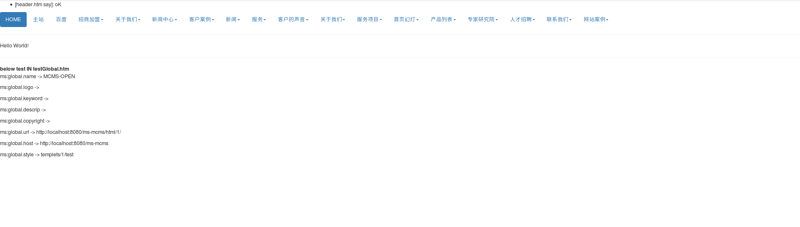

## 代码片段

暂时只有前端的  

**如何测试？**

栏目管理，将任意一个“列表”型的栏目

内容模板设置为`article_lsit.htm`，列表模板设置为`article_content.htm`

点击右上角更新，然后静态化——更新栏目（使得列表模板生效），更新文章（使得内容模板生效）

打开刚设置好的那个栏目的链接，如 http://localhost:8080/ms-mcms/html/1/59/69/index.html

### 效果图

栏目模板对应生成的效果

内容模板对应生成的效果

首页效果

