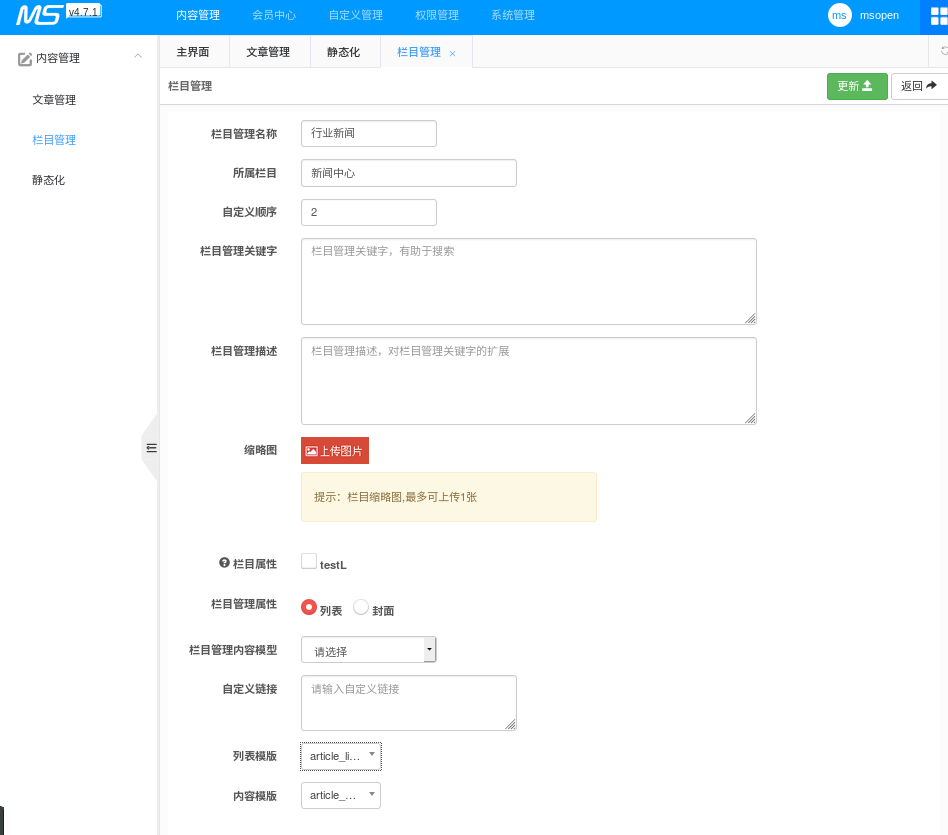
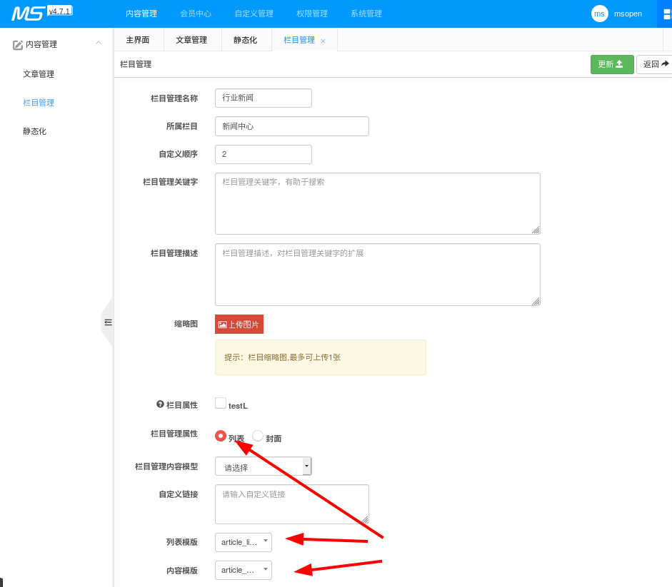
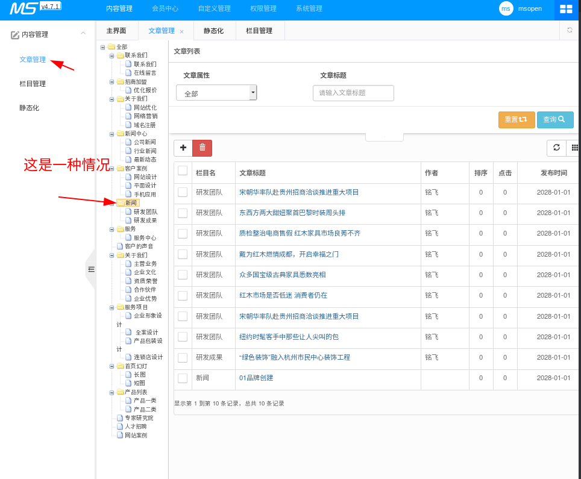
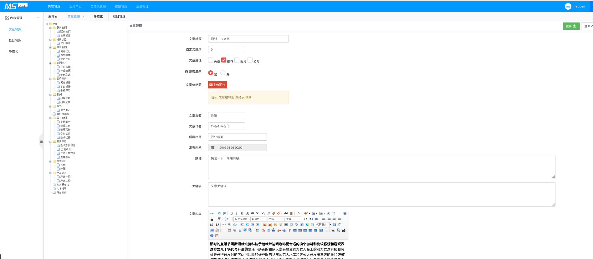
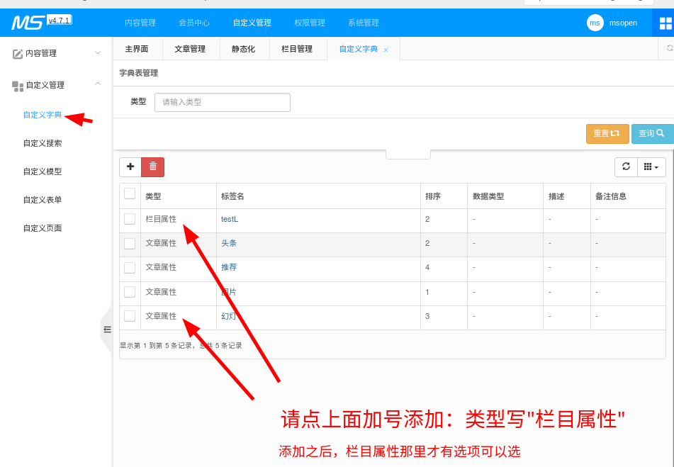
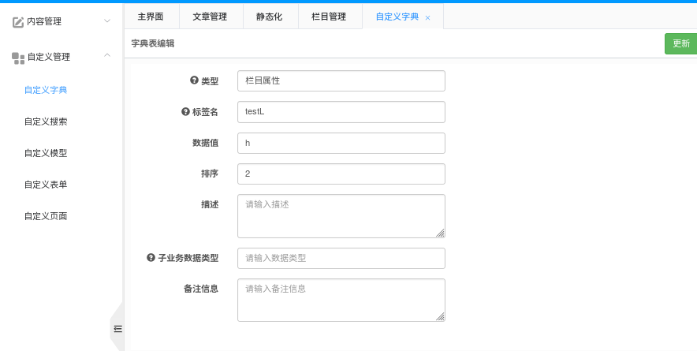
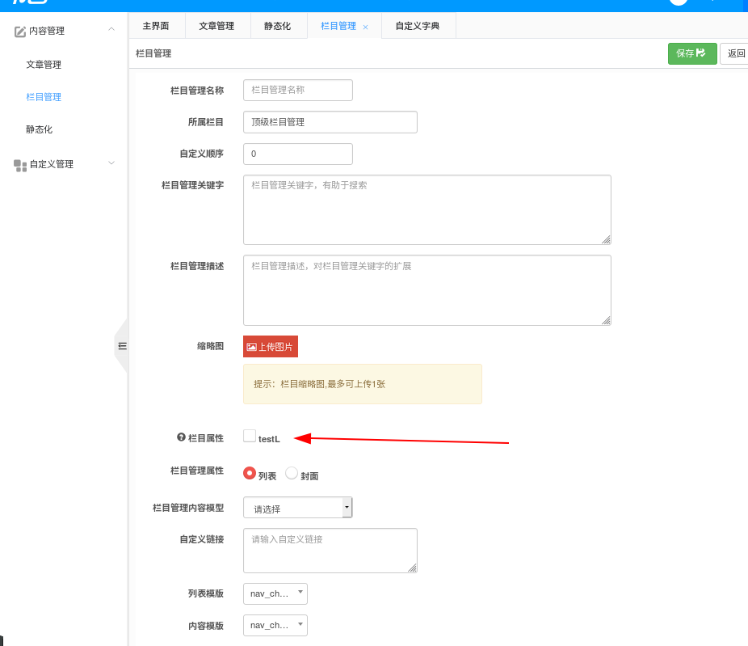

# MCMS 从使用到开发

## 基本使用与介绍

>  这里只讲基本功能，以求能够快速上手，细节上的(如编号、属性、内容/封面地址之类的)请仔细查看管理界面

### 内容管理
#### 静态化

> 静态化：后端 Java 根据模板文件来生成新的静态 html  
> 简言之，就是生成HTML文件
> 整个网站都可以分为三种：主页、栏目页、内容页，以下以文章网站举例子。

- 更新主页：`index.html`
- 更新栏目：根据“列表模板“或”封面模板”生成栏目页(如文章列表页、封面页)
- 更新文章：根据“内容模板”生成文章内容页

其实主页也是栏目页的一种，不过因为主页比较重要，所以独立出来。  

点击生成按钮时，一定要特别注意后端控制台是否有输出错误，一般抛出异常都会导致更新失败

#### 栏目管理

> 栏目管理：管理栏目的... 栏目标题就是可以放在导航栏上的东东，栏目有"封面"和"列表"两种，
 - 列表：用于放多篇文章的，[分页标签](http://doc.ms.mingsoft.net/plugs-cms/biao-qian/fen-ye-biao-qian-ms-page.html)只能用在文章模板里。
 - 封面：就是单个页面

效果如图：

##### 列表（以"新闻中心 --- 行业新闻"为例）

*栏目管理 里看到的效果*

*文章管理 里看到的效果*

##### 封面（以"关于我们 --- 主营业务"为例）

*栏目管理 里看到的效果*

*文章管理 里看到的效果*

##### 更多的细节请自行探索

> 请在文章管理那里把每个都点一下（包括有目录图标的也点一下）

#### 文章管理

> 文章管理：修改文章内容、删增文章
> 

### 自定义管理

#### 自定义字典

> 文章属性、栏目属性等之类的，都是需要在这里添加

效果图

此处例子：如果勾选了"testL"，那么在模板里就可以用`[field.flag]` 取得值`h`，详见 http://doc.ms.mingsoft.net/plugs-cms/biao-qian/lan-mu-lie-biao-ms-channel.html

### 本文更新中...

