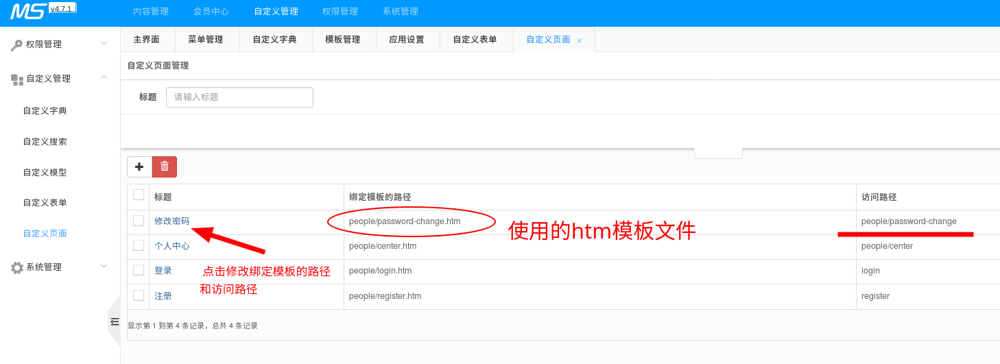

# MCMS 从使用到开发

> MCMS 使用 html 模板开发、JavaWeb Spring 开发 API/MVC 的方式，并且能够实现全站静态化生成纯`html css js`
>
> 各种手册，请在[官网](http://ms.mingsoft.net/)导航栏 或商店插件说明页 上找。
>
> 

**本仓库说明**

本人以 Java 开发人员视角来探究，和前端开发工程师侧重点有所不同，代码是从 github 上拉取的，运行上可能和一键部署脚本有区别。欢迎提建议或PR，以此解决不同环境下的差异。

关于本文的疑问或建议，欢迎提 **ISSUE**

 - `CodeSnippets`目录：标签的一些用法例子，更多请见官网文档
 - `db-Workbench-Model`目录：MySQL Workbench 可使用的视图文件
 - 一些常见问题，也可以在本仓库内容或 ISSUE 里找到答案。


重要内容：[后端开发手册-通用模块](doc.ms.mingsoft.net/dev-guide/tong-yong-mo-xing.html)

## MCMS 后台管理界面 的使用

>  这里只讲基本功能，以求能够快速上手，细节上的(如编号、属性、内容/封面地址之类的)请仔细查看管理界面
>
>  默认管理界面为 http://localhost:8080/ms-mcms/ms/index.do
>
>  帐号密码都是 msopen
>
>  默认主页 http://localhost:8080/ms-mcms/


### 内容管理

> **主页**：网站主页，我们可以在主页导航栏上放“栏目”，在主页正文放“文章列表”
>
> **栏目管理**：栏目分为“封面(单页)”和“列表”两类；封面本身就是一篇文章，列表栏目下存放着单/多篇文章；同一栏目下的文章是有共性的，在“栏目管理”里可以设置该栏目及下属文章的格式（包括文章列表模板、文章内容模板或者封面模板、设置所用的自定义内容模型）
>
> **文章管理**：仅针对文章的内容，只能对文章内容进行“增删改查”。
>
> [举个栗子] 现在要写 公司简介(About.html)
>
> - 封面（单页）：联系方式
>
> - 多篇文章内容：公司文化，交给吹上天的人才 --》可以写很多篇。
>
```
+--------------------------------------------------------+
|                                      +------+          |
|   主 页    栏 目 1    栏 目 2   栏 目 3 |关 于 |          |
|                                      +------+---+      |
|                                      |公 司 文 化 |     |
|                                      |           |     |
|                                      |联 系 方 式 |     |
|                                       +----------+     |
|                                                        |
|                                                        |
|                                                        |
|                                                        |
|                                                        |
+--------------------------------------------------------+

```

#### 静态化


> 静态化：后端 Java 根据“应用设置”里选中的模板文件来生成新的静态 html  
> 简言之，就是生成HTML文件
> 整个网站都可以分为三种：主页、栏目页、内容页，以下以文章网站举例子。

- 更新主页：根据所选模板生成首页，不改动"主页位置"则是生成`index.html`
- 更新栏目：根据“列表模板“或”封面模板”生成栏目页(如文章列表页、封面页)
- 更新文章：根据“内容模板”生成文章内容页

其实主页也是栏目页的一种，不过因为主页比较重要，所以独立出来。  

详见：[模板相关注意](#模板)

点击生成按钮时，一定要特别注意后端控制台是否有输出错误，一般抛出异常都会导致更新失败


#### 栏目管理


> 栏目管理：管理栏目的... 栏目标题就是可以放在导航栏上的东东，栏目有"封面"和"列表"两种，
 - 列表：用于放多篇文章的，[分页标签](http://doc.ms.mingsoft.net/plugs-cms/biao-qian/fen-ye-biao-qian-ms-page.html)只能用在“列表模板”里。
 - 封面：就是单个页面

注：从"列表"改为"封面"时，需要编辑"封面"的文章内容才能生效，然后下一级栏目的`index.html`才会生成


效果如图：

##### 列表

（以"新闻中心 --- 行业新闻"为例）栏目管理 里看到的效果


文章管理 里看到的效果


##### 封面

（以"关于我们 --- 主营业务"为例）栏目管理 里看到的效果


文章管理 里看到的效果


##### 更多的细节请自行探索

> 请在文章管理那里把每个都点一下（包括有目录图标的也点一下）

下图是“列表”型，列表下存放着相同类型文章(同栏目下的文章拥有：相同模板、相同字段)


下图是“封面（单页）”型，封面型栏目自身就是一篇文章。


#### 文章管理

> 文章管理：修改文章内容、删增文章


### 会员中心

待更新

### 自定义管理

> 详见官方文档：http://doc.ms.mingsoft.net/plugs-diy/

#### 自定义字典

> 文章属性、栏目属性等之类的，都是需要在这里添加


效果图


此处例子：如果勾选了"testL"，那么在模板里就可以用`[field.flag]` 取得值`h`，详见 http://doc.ms.mingsoft.net/plugs-cms/biao-qian/lan-mu-lie-biao-ms-channel.html

#### 自定义搜索

#### 自定义模型

> 其实用来建自定义的数据库及其表的
>
> 添加“自定义模型”之后，可在“栏目管理”里设置任一栏目的


我们拿这些来测试


以封面类型的栏目为例子设置刚才增加的自定义模型，并更新


然后再 “内容管理” -》 “静态化” -》 更新生成你刚才修改的栏目

然后在文章管理下点开你刚才修改的栏目下的某篇文章，点编辑文章就可以看到


<hr/>
"自定义模型字段"对应的""数据库字段类型"，如下图（以4.7.1 2018-08-15版本为例，各版本可能有差异）


"自定义模型类型"对应的"HTML表单"，如下图


以上三张图由 `JH` 提供，选项如果需要值，在默认值里填入并用逗号分隔即可  

例如单选框、多选框，这两个都是可以填入多个默认值的  

**自定义管理 数据的修改都在名称一栏的超链接里，如**  


效果


#### 自定义表单


详见 [MCMS 使用手册 - 自定义表单](http://doc.ms.mingsoft.net/mcms-user-guide/xi-tong-guan-li/zi-ding-yi-biao-dan.html)

#### 自定义页面



模板文件代码及路径如下


效果如图


### 权限管理

待更新

### 系统管理

#### 模板管理

**注意：** 4.7.1版本在 `servlet: multipart.enabled: true`的配置下，MCMS的上传功能全部出错。但是使用MCMS默认值 `false` 却又导致自定义的API无法上传文件....


这里的模板可以使用"上传文件"按钮，也可以手动解压模板到 `src/main/webapp/templets/1/ `目录下

#### 应用设置

> 这里是更换全局模板的地方


MCMS的上传模板功能有bug(会把模板里的路径斜杠符号去掉，如去掉了/)，所以建议不使用上传模板功能，需要时直接把模板解压到src/main/webapp/templets/1/
另外，

- 模板目录 src/main/webapp/templets/1/
- 生成的静态文件在 src/main/webapp/html/1/下
  - 桌面端网页为index.html
  - 移动端为m/index.html
  - 其余目录多为MCMS文章目录


以上，1代表id为1的站点，详见MCMS全局通用标签


## 基于 MCMS 开发

### 熟悉使用 MCMS 后台

### MCMS 提供的 API

[文件上传](http://doc.ms.mingsoft.net/plugs-cms/jie-kou/shang-chuan-wen-jian.html)，文件表(file)也是独立的、没有外键关联的表

更多请见：

- MCMS 提供的 API 文档：http://doc.ms.mingsoft.net/ms-api-front/

- Swagger生成的文档：http://localhost:8080/ms-mcms/swagger-ui.html
- 如需开发自定义 API ， 百度搜索“SpringBoot 项目开发”

推荐较好的第三方库：

-   Mybatis-Plus 好像暂时用不了
- [JAuth](https://github.com/harvardinformatics/JAuth)

**文章编辑的API**

http://localhost:8080/ms-mcms/ms/cms/article/220/edit

或者

http://localhost:8080/ms-mcms/ms/cms/article/220/edit.do


源码详解


其他同理，可以在源码里找（包名 net.mingsoft.cms.action）


### 模板

#### ms:标签

**值得一提的是**，模板文件里的`<#include "filename">`其实是 FreeMarker 模板的指令，见：[FreeMarker 参考](http://freemarker.foofun.cn/ref_directive_include.html)；而ms:global这些标签，则是基于 FreeMarker 封装的，具体可见 MCMS 数据库里的表`mdiy_tag`、`mdiy_tag_sql`


所以理论上可以做到：

- 在模板里写 FreeMarker 指令

- 直接在这两个表里加数据，应该就可以实现自定义标签（欢迎尝试：如造一个 `ms:mydiy`标签）


### 本文更新中...


