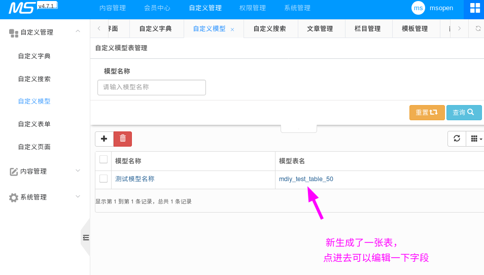

# MCMS 从使用到开发

## 基本使用与介绍

>  这里只讲基本功能，以求能够快速上手，细节上的(如编号、属性、内容/封面地址之类的)请仔细查看管理界面
>
>  标签的一些用法例子在本仓库目录`CodeSnippets`里，更多请见官网文档

### 内容管理

> 主页：网站主页，我们可以在主页导航栏上放“栏目”，在主页正文放“文章列表”
>
> 栏目管理：栏目分为“封面(单页)”和“列表”两类；封面本身就是一篇文章，列表栏目下存放着单/多篇文章；同一栏目下的文章是有共性的，在“栏目管理”里可以设置该栏目及下属文章的格式（包括文章列表模板、文章内容模板或者封面模板、设置所用的自定义内容模型）
>
> 文章管理：仅针对文章的内容，只能对文章内容进行“增删改查”。
>
> [举例子] 现在要写 公司简介(About.html)
>
> - 封面（单页）：联系方式
>
> - 多篇文章内容：公司文化，可以写很多篇。
>
```
+--------------------------------------------------------+
|                                      +------+          |
|   主 页    栏 目 1    栏 目 2   栏 目 3 |关 于 |          |
|                                      +------+---+      |
|                                      |公 司 文 化 |     |
|                                      |           |     |
|                                      |联 系 方 式 |     |
|                                       +----------+     |
|                                                        |
|                                                        |
|                                                        |
|                                                        |
|                                                        |
+--------------------------------------------------------+

```

#### 静态化


> 静态化：后端 Java 根据模板文件来生成新的静态 html  
> 简言之，就是生成HTML文件
> 整个网站都可以分为三种：主页、栏目页、内容页，以下以文章网站举例子。

- 更新主页：`index.html`
- 更新栏目：根据“列表模板“或”封面模板”生成栏目页(如文章列表页、封面页)
- 更新文章：根据“内容模板”生成文章内容页

其实主页也是栏目页的一种，不过因为主页比较重要，所以独立出来。  

点击生成按钮时，一定要特别注意后端控制台是否有输出错误，一般抛出异常都会导致更新失败


#### 栏目管理


> 栏目管理：管理栏目的... 栏目标题就是可以放在导航栏上的东东，栏目有"封面"和"列表"两种，
 - 列表：用于放多篇文章的，[分页标签](http://doc.ms.mingsoft.net/plugs-cms/biao-qian/fen-ye-biao-qian-ms-page.html)只能用在“列表模板”里。
 - 封面：就是单个页面

效果如图：

##### 列表（以"新闻中心 --- 行业新闻"为例）

*栏目管理 里看到的效果*


*文章管理 里看到的效果*


##### 封面（以"关于我们 --- 主营业务"为例）

*栏目管理 里看到的效果*


*文章管理 里看到的效果*


##### 更多的细节请自行探索

> 请在文章管理那里把每个都点一下（包括有目录图标的也点一下）

下图是“列表”型，列表下存放着相同类型文章(同栏目下的文章拥有：相同模板、相同字段)


下图是“封面（单页）”型，封面型栏目自身就是一篇文章。


#### 文章管理


> 文章管理：修改文章内容、删增文章
> 


### 自定义管理

#### 自定义字典

> 文章属性、栏目属性等之类的，都是需要在这里添加


效果图


此处例子：如果勾选了"testL"，那么在模板里就可以用`[field.flag]` 取得值`h`，详见 http://doc.ms.mingsoft.net/plugs-cms/biao-qian/lan-mu-lie-biao-ms-channel.html

#### 自定义搜索

#### 自定义模型

> 其实用来建自定义的数据库及其表的
>
> 添加“自定义模型”之后，可在“栏目管理”里设置任一栏目的





我们拿这些来测试


以封面类型的栏目为例子设置刚才增加的自定义模型，并更新


然后再 “内容管理” -》 “静态化” -》 更新生成你刚才修改的栏目

然后在文章管理下点开你刚才修改的栏目下的某篇文章，点编辑文章就可以看到


<hr/>

"自定义模型字段"对应的""数据库字段类型"，如下图（以4.7.1 2018-08-15版本为例，各版本可能有差异）


"自定义模型类型"对应的"HTML表单"，如下图


以上三张图由 `JH` 提供，选项如果需要值，在默认值里填入并用逗号分隔即可  

### 本文更新中...


